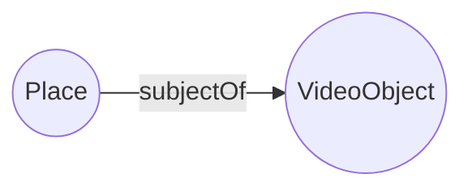

# VideoObject





# Examples
## Example 1

```json
{
  "@context": "https://schema.org",
  "@type": "Place",
  "name": "Example Place",
  "address": {
    "@type": "PostalAddress",
    "streetAddress": "123 Main Street",
    "addressLocality": "City",
    "addressRegion": "State",
    "postalCode": "12345",
    "addressCountry": "Country"
  },
  "subjectOf": {
    "@type": "VideoObject",
    "name": "Example Video",
    "description": "An example video from YouTube",
    "contentUrl": "https://www.youtube.com/watch?v=VIDEO_ID",
    "embedUrl": "https://www.youtube.com/embed/VIDEO_ID",
    "uploadDate": "2022-01-01",
    "duration": "PT1M30S",
    "thumbnailUrl": "https://example.com/thumbnail.jpg",
    "publisher": {
      "@type": "Organization",
      "name": "YouTube"
    }
  }
}

```